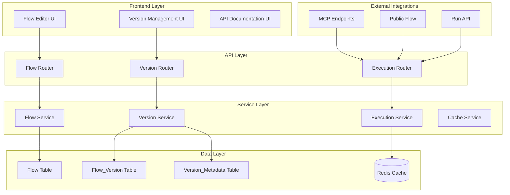

# Flow Versioning System

Este documento consolida o design, os requisitos e o plano de implementação para o sistema de versionamento de flows do Langflow. O objetivo é oferecer uma visão única e organizada das decisões de arquitetura, funcionalidades esperadas e etapas necessárias para entrega do recurso.

## System Overview

O sistema de versionamento adota um modelo semelhante ao Git, onde existe um diretório de trabalho editável (draft) e múltiplas versões publicadas imutáveis. Cada flow mantém um histórico completo de versões e possui um apontador para a versão ativa utilizada em produção.

### Principais Características

- **Dual-State Model**: separação entre draft editável e versões publicadas imutáveis.
- **Active Version Management**: controle centralizado da versão usada em produção.
- **Seamless Integration**: integração transparente com endpoints existentes (API, MCP, public_flow).
- **Version History**: histórico completo com metadados e rastreabilidade.
- **Rollback Capability**: reversão rápida para versões anteriores.

## Architecture

### Componentes Principais



### Database Schema

#### Tabela `flow` (modificada)
```sql
ALTER TABLE flow ADD COLUMN IF NOT EXISTS is_draft BOOLEAN DEFAULT true;
ALTER TABLE flow ADD COLUMN IF NOT EXISTS active_version_id UUID REFERENCES flow_version(id);
ALTER TABLE flow ADD COLUMN IF NOT EXISTS version_count INTEGER DEFAULT 0;
ALTER TABLE flow ADD COLUMN IF NOT EXISTS last_published_at TIMESTAMP;

CREATE INDEX IF NOT EXISTS idx_flow_is_draft ON flow(is_draft);
CREATE INDEX IF NOT EXISTS idx_flow_active_version ON flow(active_version_id);
```

#### Nova tabela `flow_version`
```sql
CREATE TABLE flow_version (
   id UUID PRIMARY KEY DEFAULT gen_random_uuid(),
   flow_id UUID NOT NULL REFERENCES flow(id) ON DELETE CASCADE,
   version_number INTEGER NOT NULL,
   version_tag VARCHAR(50),
   name VARCHAR(255) NOT NULL,
   description TEXT,
   data JSONB NOT NULL,
   icon VARCHAR(255),
   icon_bg_color VARCHAR(7),
   gradient VARCHAR(255),
   endpoint_name VARCHAR(255),
   tags JSONB DEFAULT '[]',
   mcp_enabled BOOLEAN DEFAULT false,
   run_in_background BOOLEAN DEFAULT false,
   action_name VARCHAR(255),
   action_description TEXT,
   access_type access_type_enum DEFAULT 'PRIVATE',
   is_active BOOLEAN DEFAULT false,
   published_by UUID NOT NULL REFERENCES "user"(id),
   published_at TIMESTAMP NOT NULL DEFAULT NOW(),
   description_version TEXT,
   changelog TEXT,
   created_from_version_id UUID REFERENCES flow_version(id),
   parent_flow_data_hash VARCHAR(64),
   created_at TIMESTAMP NOT NULL DEFAULT NOW(),
   updated_at TIMESTAMP NOT NULL DEFAULT NOW(),
   UNIQUE(flow_id, version_number),
   UNIQUE(flow_id, version_tag)
);

CREATE INDEX idx_flow_version_flow_id ON flow_version(flow_id);
CREATE INDEX idx_flow_version_active ON flow_version(flow_id, is_active) WHERE is_active = true;
CREATE INDEX idx_flow_version_published_at ON flow_version(published_at DESC);
CREATE INDEX idx_flow_version_number ON flow_version(flow_id, version_number DESC);
```

#### Nova tabela `version_metadata`
```sql
CREATE TABLE version_metadata (
   id UUID PRIMARY KEY DEFAULT gen_random_uuid(),
   version_id UUID NOT NULL REFERENCES flow_version(id) ON DELETE CASCADE,
   execution_count BIGINT DEFAULT 0,
   last_executed_at TIMESTAMP,
   total_execution_time_ms BIGINT DEFAULT 0,
   avg_execution_time_ms DECIMAL(10,2),
   error_count BIGINT DEFAULT 0,
   last_error_at TIMESTAMP,
   api_executions BIGINT DEFAULT 0,
   mcp_executions BIGINT DEFAULT 0,
   public_executions BIGINT DEFAULT 0,
   webhook_executions BIGINT DEFAULT 0,
   deployment_environment VARCHAR(50),
   rollback_count INTEGER DEFAULT 0,
   created_at TIMESTAMP NOT NULL DEFAULT NOW(),
   updated_at TIMESTAMP NOT NULL DEFAULT NOW()
);

CREATE INDEX idx_version_metadata_version_id ON version_metadata(version_id);
CREATE INDEX idx_version_metadata_executions ON version_metadata(execution_count DESC);
```

## Data Models

### Pydantic Models

```python
class VersionStatus(str, Enum):
   DRAFT = "draft"
   PUBLISHED = "published"
   ACTIVE = "active"
   ARCHIVED = "archived"
```

```python
class FlowVersionBase(BaseModel):
   version_number: int
   version_tag: Optional[str] = None
   description_version: Optional[str] = None
   changelog: Optional[str] = None
   name: str
   description: Optional[str] = None
   data: dict
   icon: Optional[str] = None
   icon_bg_color: Optional[str] = None
   gradient: Optional[str] = None
   endpoint_name: Optional[str] = None
   tags: List[str] = []
   mcp_enabled: bool = False
   run_in_background: bool = False
   action_name: Optional[str] = None
   action_description: Optional[str] = None
   access_type: str = "PRIVATE"
```

```python
class FlowVersionCreate(FlowVersionBase):
   flow_id: UUID
   published_by: UUID
   created_from_version_id: Optional[UUID] = None
```

```python
class FlowVersionRead(FlowVersionBase):
   id: UUID
   flow_id: UUID
   is_active: bool
   published_by: UUID
   published_at: datetime
   created_from_version_id: Optional[UUID] = None
   execution_count: int = 0
   last_executed_at: Optional[datetime] = None
   avg_execution_time_ms: Optional[float] = None
   error_count: int = 0
```

```python
class FlowVersionUpdate(BaseModel):
   description_version: Optional[str] = None
   changelog: Optional[str] = None
   is_active: Optional[bool] = None
```

```python
class FlowVersionSummary(BaseModel):
   id: UUID
   version_number: int
   version_tag: Optional[str] = None
   is_active: bool
   published_at: datetime
   description_version: Optional[str] = None
   execution_count: int = 0
   error_count: int = 0
```

```python
class FlowWithVersions(BaseModel):
   id: UUID
   name: str
   description: Optional[str] = None
   is_draft: bool = True
   active_version_id: Optional[UUID] = None
   version_count: int = 0
   last_published_at: Optional[datetime] = None
   versions: List[FlowVersionSummary] = []
   active_version: Optional[FlowVersionRead] = None
   draft_data: Optional[dict] = None
```

```python
class VersionComparisonResult(BaseModel):
   version_a: FlowVersionRead
   version_b: FlowVersionRead
   differences: dict
   summary: str
```

```python
class VersionMetrics(BaseModel):
   version_id: UUID
   execution_count: int
   error_count: int
   avg_execution_time_ms: float
   last_executed_at: Optional[datetime]
   api_executions: int
   mcp_executions: int
   public_executions: int
   webhook_executions: int
```

### SQLModel Entities

```python
class Flow(SQLModel, table=True):
   is_draft: bool = Field(default=True)
   active_version_id: Optional[UUID] = Field(default=None, foreign_key="flow_version.id")
   version_count: int = Field(default=0)
   last_published_at: Optional[datetime] = Field(default=None)
   versions: List["FlowVersion"] = Relationship(back_populates="flow")
   active_version: Optional["FlowVersion"] = Relationship(
       sa_relationship_kwargs={"foreign_keys": "[Flow.active_version_id]"}
   )
```

```python
class FlowVersion(SQLModel, table=True):
   __tablename__ = "flow_version"
   id: UUID = Field(default_factory=uuid4, primary_key=True)
   flow_id: UUID = Field(foreign_key="flow.id", index=True)
   version_number: int
   version_tag: Optional[str] = None
   name: str
   description: Optional[str] = None
   data: dict = Field(sa_column=Column(JSON))
   icon: Optional[str] = None
   icon_bg_color: Optional[str] = None
   gradient: Optional[str] = None
   endpoint_name: Optional[str] = None
   tags: List[str] = Field(default=[], sa_column=Column(JSON))
   mcp_enabled: bool = Field(default=False)
   run_in_background: bool = Field(default=False)
   action_name: Optional[str] = None
   action_description: Optional[str] = None
   access_type: AccessTypeEnum = Field(default=AccessTypeEnum.PRIVATE)
   is_active: bool = Field(default=False)
   published_by: UUID = Field(foreign_key="user.id")
   published_at: datetime = Field(default_factory=lambda: datetime.now(timezone.utc))
   description_version: Optional[str] = None
   changelog: Optional[str] = None
   created_from_version_id: Optional[UUID] = Field(default=None, foreign_key="flow_version.id")
   parent_flow_data_hash: Optional[str] = None
   created_at: datetime = Field(default_factory=lambda: datetime.now(timezone.utc))
   updated_at: datetime = Field(default_factory=lambda: datetime.now(timezone.utc))
   flow: "Flow" = Relationship(back_populates="versions")
   published_by_user: "User" = Relationship()
   metadata: Optional["VersionMetadata"] = Relationship(back_populates="version")
   __table_args__ = (
       UniqueConstraint("flow_id", "version_number", name="unique_flow_version_number"),
       UniqueConstraint("flow_id", "version_tag", name="unique_flow_version_tag"),
       Index("idx_flow_version_active", "flow_id", "is_active"),
   )
```

```python
class VersionMetadata(SQLModel, table=True):
   __tablename__ = "version_metadata"
   id: UUID = Field(default_factory=uuid4, primary_key=True)
   version_id: UUID = Field(foreign_key="flow_version.id", unique=True)
   execution_count: int = Field(default=0)
   last_executed_at: Optional[datetime] = None
   total_execution_time_ms: int = Field(default=0)
   avg_execution_time_ms: Optional[float] = None
   error_count: int = Field(default=0)
   last_error_at: Optional[datetime] = None
   api_executions: int = Field(default=0)
   mcp_executions: int = Field(default=0)
   public_executions: int = Field(default=0)
   webhook_executions: int = Field(default=0)
   deployment_environment: Optional[str] = Field(default="production")
   rollback_count: int = Field(default=0)
   created_at: datetime = Field(default_factory=lambda: datetime.now(timezone.utc))
   updated_at: datetime = Field(default_factory=lambda: datetime.now(timezone.utc))
   version: "FlowVersion" = Relationship(back_populates="metadata")
```

## Services and Interfaces

### Version Service

```python
class VersionService:
   async def publish_version(...):
       """Publica uma nova versão imutável de um flow."""

   async def get_active_version(...):
       """Retorna a versão ativa de um flow."""

   async def set_active_version(...):
       """Define uma versão como ativa."""

   async def get_version_history(...):
       """Retorna o histórico de versões."""

   async def create_draft_from_version(...):
       """Cria um draft a partir de uma versão."""

   async def compare_versions(...):
       """Compara duas versões."""

   async def get_version_metrics(...):
       """Retorna métricas da versão."""

   async def rollback_to_version(...):
       """Faz rollback para uma versão específica."""
```

### Flow Execution Service

```python
class FlowExecutionService:
   async def execute_flow(...):
       """Executa um flow usando a versão ativa ou uma versão específica."""

   async def get_flow_for_execution(...):
       """Resolve qual versão do flow executar."""

   async def record_execution_metrics(...):
       """Registra métricas de execução."""
```

### Cache Service

```python
class VersionCacheService:
   async def cache_active_version(...)
   async def get_cached_active_version(...)
   async def invalidate_flow_cache(...)
   async def cache_version_data(...)
```

## Error Handling

### Custom Exceptions

```python
class VersioningError(Exception):
   pass

class VersionNotFoundError(VersioningError):
   pass

class ActiveVersionNotSetError(VersioningError):
   pass

class VersionImmutableError(VersioningError):
   pass

class InvalidVersionOperationError(VersioningError):
   pass

class VersionConflictError(VersioningError):
   pass
```

### Error Handling Strategy

```python
class VersionErrorHandler:
   @staticmethod
   def handle_version_not_found(...):
       return HTTPException(status_code=404, ...)

   @staticmethod
   def handle_no_active_version(...):
       return HTTPException(status_code=409, ...)

   @staticmethod
   def handle_immutable_version(...):
       return HTTPException(status_code=400, ...)
```

## Testing Strategy

### Unit Tests

- `test_publish_version_creates_immutable_copy`
- `test_set_active_version_updates_endpoints`
- `test_rollback_changes_active_version`
- `test_create_draft_from_version_preserves_data`
- `test_execution_uses_active_version`
- `test_execution_with_specific_version`
- `test_execution_records_metrics`
- `test_publish_version_endpoint`
- `test_get_version_history_endpoint`
- `test_set_active_version_endpoint`

### Integration Tests

- `test_end_to_end_version_workflow`
- `test_mcp_integration_with_versions`
- `test_public_flow_integration_with_versions`
- `test_api_integration_with_versions`
- `test_version_resolution_performance`
- `test_cache_effectiveness`
- `test_concurrent_version_operations`

### Load Tests

- `test_high_volume_version_execution`
- `test_version_switching_under_load`
- `test_metrics_collection_performance`

## Performance Considerations

- **Caching Strategy**: cache de versão ativa e dados de versões específicas no Redis.
- **Database Optimization**: índices dedicados e possibilidade de particionamento de métricas.
- **Memory Management**: lazy loading, limpeza automática do cache e compressão.

## Security Considerations

- **Access Control**: permissões específicas para publicar, ativar e fazer rollback.
- **Data Protection**: imutabilidade garantida, backup automático e criptografia de dados sensíveis.

## Migration Strategy

1. Adicionar campos de versionamento à tabela `flow`.
2. Criar tabelas `flow_version` e `version_metadata`.
3. Migrar flows existentes para estado de draft.
4. Criar versões iniciais conforme necessário.

Scripts de migração e rollback são detalhados para cada etapa.

## Requirements Specification

Cada requisito é representado como user story com critérios de aceite. Exemplos:

- **Requirement 1**: publicação de versões imutáveis.
- **Requirement 3**: definição de versão ativa e atualização automática de endpoints.
- **Requirement 6**: rollback rápido para versões anteriores.
- **Requirement 10**: monitoramento de adoção de versões.

Os dez requisitos completos estão listados com critérios de aceite para orientar implementação e validação.

## Implementation Plan

O plano é dividido em dez macro tarefas, cada uma desdobrada em subtarefas. Destaques:

1. **Infraestrutura de dados**: modelos, migrações e testes iniciais.
2. **Serviços core**: VersionService, FlowService e cache.
3. **Execução de flows**: atualização de endpoints e coleta de métricas.
4. **APIs REST**: novos endpoints para gerenciamento de versões.
5. **Integrações externas**: MCP e public_flow usando versão ativa.
6. **Métricas e monitoramento**: coleta, relatórios e alertas.
7. **Interface de usuário**: componentes React para versionamento.
8. **Cache e otimização**: melhorias de performance.
9. **Segurança**: permissões, audit trail e rate limiting.
10. **Documentação e migração**: guias, scripts e validações.

Subtarefas marcadas com `*` são opcionais ou planejadas para uma fase posterior de testes.

---

Este documento serve como referência única para o desenvolvimento do sistema de versionamento de flows, alinhando stakeholders e facilitando o acompanhamento do progresso.
